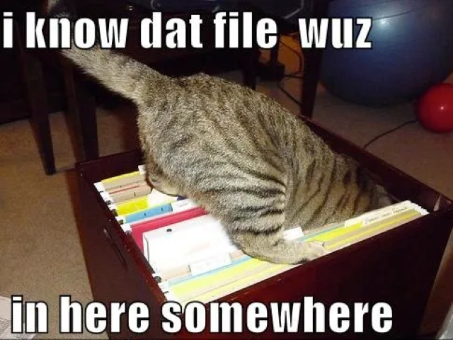
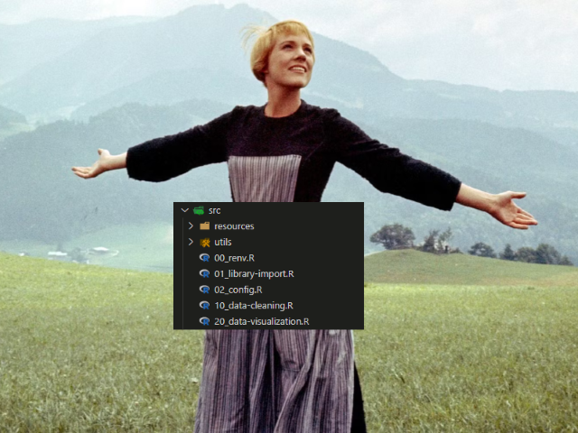
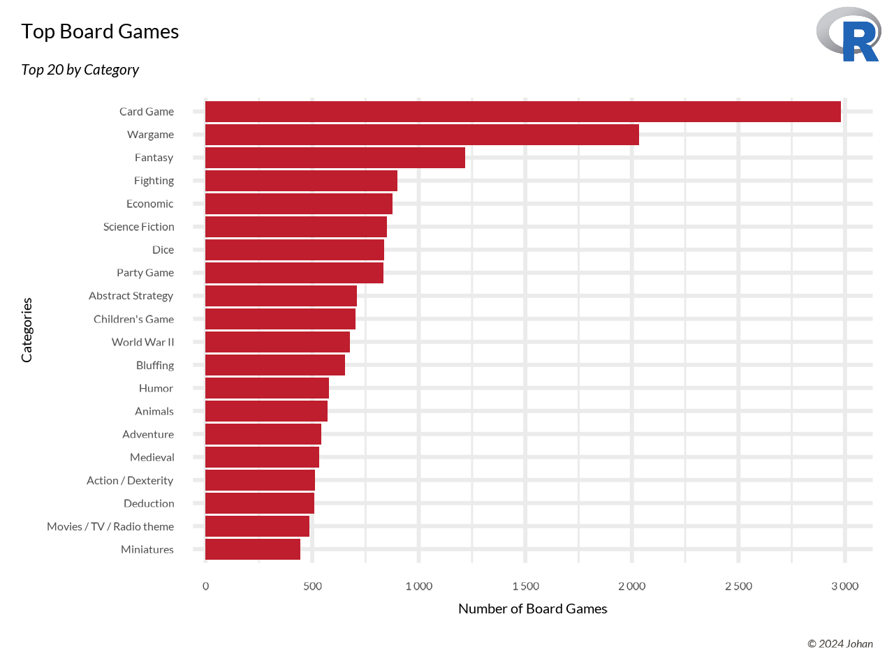

# 📝Folder Structure for R projects

## 📜 Why care about folder structure?
### Introduction
You're probably wondering why it's even important to have a folder structure for your R projects? Why not just have everything in one file? Well, here are a few reasons why you should care about folder structure:
1. *Readability*: Having a well-organized folder structure makes it easier for you and others to read and understand your code. This means splitting large scripts into smaller, more manageable files, and organizing them in a logical way. For example, one script will contain all the data cleaning code, another will contain the data visualization code, etc. This makes it easier to find and navigate through your code.
2. *Reusability*: By organizing your code into smaller, more modular files, you can reuse code across different projects. It also means that you can easily share code with others, as they can simply copy the relevant files into their own projects.
3. *Collaboration*: If you're working on a project with others, having a well-organized folder structure makes it easier to collaborate. Everyone knows where to find the relevant files, and it's clear who is responsible for what.
4. *Reproducibility*: Having a well-organized folder structure makes it easier to reproduce your analysis. If you need to rerun your analysis at a later date, or if someone else wants to reproduce your results, they can simply follow the folder structure and run the relevant scripts. I'll also show you how to set up renv: a package that helps you manage your R package dependencies, making it easier to reproduce your analysis! Especially for anyone who might not have the same package versions installed on their machine.

So sit back, relax and let me show you how to set up a folder structure for your R projects!

| Before   | After     |
| -------- | --------- |
|  |  |

### The big folder structure

Here is the [folder structure](https://tree.nathanfriend.io) of this project. It might look a bit overwhelming at first, but don't worry, I'll walk you through it step by step! 💆‍♂️ 

``` txt
.
└── my-awesome-project/
    ├── data/
    │   ├── processed/
    │   │   ├── 01_categorical_variables.rds
    │   │   └── 02_categorical_counts.rds
    │   └── raw/
    │       └── board_games.csv
    ├── docs/
    │   └── images
    ├── output/
    │   ├── data/
    │   │   └── 02_categorical_counts.csv
    │   └── plots/
    │       └── 01_categorical_plot.png
    ├── renv
    ├── src/
    │   ├── resources/
    │   │   └── logo.png
    │   ├── utils/
    │   │   ├── 01_theme.R
    │   │   └── 02_save-and-load.R
    │   ├── 00_renv.R
    │   ├── 01_library-import.R
    │   ├── 02_config.R
    │   ├── 10_data-cleaning.R
    │   └── 20_data-visualization.R
    ├── temp/
    │   └── EDA.Rmd
    ├── .gitignore
    ├── .Renviron
    ├── .Renviron-example.txt
    ├── LICENSE
    ├── main.R
    ├── my-awesome-project.Rproj
    ├── README.md
    └── renv.lock
```

📁 **Data folder**

This folder contains all the data used in the project. It is divided into two subfolders:
- 📁 **raw**: Contains the raw data files that are read into R. This is the as-is data! Exactly how it's downloaded from the web or the database using a SELECT query. In our example, it is the [board_games.csv](data/raw/board_games.csv) data from [tidytuesday](https://github.com/rfordatascience/tidytuesday/tree/master/data/2019/2019-03-12). Never ever ever edit the raw data files! That's a **big** no no! We want complete reproducibility.
- 📁 **processed**: Contains the processed data files that are generated by the scripts in the `src/` folder. This is the data that has been cleaned, transformed, and is ready for analysis. In our example, it contains the [categorical_variables.rds](data/processed/01_categorical_variables.rds) and [categorical_counts.rds](data/processed/02_categorical_counts.rds) files. We save the data cleaning files to better separate the cleaning from the visualization. It might take forever to perform the cleaning! We would therefore like to save the file and explicitly load in the clean data in the visualization step. I have written two functions that will make it easier to save and load `*.rds` files. You can have a look at them in [02_save-and-load.R](src/utils/02_save-and-load.R), but this is how we would use them:

``` r
# Save the file
save_to_processed(categorical_counts, "02_categorical_counts.rds")

# load the file
categorical_counts <- load_from_processed("02_categorical_counts.rds")
```

📁 **Docs folder**

This is more a folder for the documentation of the project. It contains the images used in the README file. You can also save any other documentation files in this folder.

📁 **Output folder**

This folder contains the output files generated by the scripts in the `src/` folder. It is divided into two subfolders:
- 📁 **data**: Contains the output data files generated by the scripts. In our example, it contains the [02_categorical_counts.csv](output/data/02_categorical_counts.csv) file. This folder won't be used that often. It's mostly for when an excel or csv file would be part of the final result.
- 📁 **plots**: Contains the output plot files generated by the scripts. In our example, it contains the [01_categorical_plot.png](output/plots/01_category_plot.png) file. This is the plot that is generated by the scripts.

It's always good to have a good theme going. You want your plots to have a good brand! I have created a theme that you can use in your plots. You can find it in the [01_theme.R](src/utils/01_theme.R) file. You can simply use it in your plot like this:

``` r
data %>%
    ggplot(aes(x = x, y = y)) +
    geom_point() +  # And any other ggplot things you usually do
    my_custom_theme()  # Where the magic happens!
```

The plot also adds a copyright caption at the bottom of the plot. Remember to change the `company_name` variable in [`my_custom_theme`](src/utils/01_theme.R), otherwise my name will be on all your plots! 😂

You can also add your own palette to the [`color_palette`](src/utils/01_theme.R) list! Lastly, I defined a function called [`process_plot`](src/utils/01_theme.R) that can be used like this:

```r
process_plot(my_plot, "my_plot_name")
```

Which saves a `*.png` plot in the [`output/plots`](output/plots/) folder. The plot will be saved with the name `my_plot_name.png`. It will also add your very own logo to the plot. By default it will always add it to the top right of the corner. You can easily tweak the position and scale of the logo:

```r
# Add the logo to the top right
process_plot(
    my_plot,
    "my_plot_name",
    logo_size = 0.1, # The size of the logo
    logo_position = c("top", "right"),
)

# Add the logo to the bottom center
process_plot(
    my_plot,
    "my_plot_name",
    logo_size = 0.1, # The size of the logo
    logo_position = c("bottom", "center"),
)
```

You can also define a [google font](https://fonts.google.com) in [01_theme.R](src/utils/01_theme.R). The final result will look something like:



The logo is save in the [src/resources](src/resources/) folder. You can replace it with your own logo. The logo is saved as a `.png` file. Just remember to tweak the `logo_size` default parameter for your logo's needs!

📁 **src folder**

This is where we will spend most of our time. It contains all the R scripts used in the project. It is divided into two subfolders:
- 📁 **resources**: Contains any resources used in the project, such as images, logos, etc. In our example, it contains the [logo.png](src/resources/logo.png) file. This is the logo that is added to the plots.
- 📁 **utils**: Contains utility functions used in the project. In our example, it contains the [01_theme.R](src/utils/01_theme.R) and [02_save-and-load.R](src/utils/02_save-and-load.R) files. These are the utility functions that are used in the project. The `01_theme.R` file contains the custom ggplot2 theme, and the `02_save-and-load.R` file contains the functions to save and load `*.rds` files. You can add any other utility functions you need in this folder.

You'll also notice that the scripts are numbered. This is to ensure that they are run in the correct order. The scripts are run in the following order:
1. `00_renv.R`: This script sets up the renv environment for the project. It installs the necessary packages and sets up the renv environment. You can read more about renv [here](https://rstudio.github.io/renv/articles/renv.html). More on this later. The renv also reads in any environment variables that are saved in the `.Renviron` file. This is useful for saving any sensitive information, such as API keys, etc. Note that the `.Renviron` file is not saved in the repository. You can find an example of the `.Renviron` file in the [.Renviron-example.txt](.Renviron-example.txt) file. It's good to keep both of them up to date.
2. `01_library-import.R`: This script imports the necessary libraries for the project. It is good practice to import all the libraries at the beginning of the script, so you know which libraries are being used.
3. `02_config.R`: This script contains any configuration settings for the project. In our example, the config:
    - Declares the folder paths
    - Runs the utils scripts
4. `10_data-cleaning.R`: This script contains the data cleaning code for the project. It reads in the raw data, cleans it, and saves the processed data to the [data/processed](data/processed/) folder. In our example, it contains the data cleaning code for the board games data.
5. `20_data-visualization.R`: This script contains the data visualization code for the project. It reads in the processed data, creates the plots, and saves them to the [output/plots](output/plots/) folder. In our example, it contains the data visualization code for the board games data.

The numbering and the way we save files are very important. You can read the full explanation in [Jenny Bryan's presentation](https://www2.stat.duke.edu/~rcs46/lectures_2015/01-markdown-git/slides/naming-slides/naming-slides.pdf), but it boils down to having your files:
1. Machine readable (can use regex or search on your files)
2. Human readable
3. Plays well with default ordering

Note that it is also a good idea to start off by counting in tens. This way you can easily add new scripts in between the existing ones. For example, if you need to add a new script between `10_data-cleaning.R` and `20_data-visualization.R`, you can name it `15_new-script.R`. This way you can easily add new scripts without having to rename all the existing scripts.

📁 **Temp folder**

This folder contains any temporary files used in the project. In our example, it contains the [EDA.Rmd](temp/EDA.Rmd) file. This is a temporary R Markdown file that is used for exploratory data analysis. You can save any other temporary files in this folder. Temporary in our project means that is not part of the final result/deliverable.

📄 **.gitignore**

This file contains the files and folders that should be ignored by git.

📄 **.Renviron**

This file contains any environment variables that are used in the project. It is good practice to save any sensitive information, such as API keys, etc., in this file. Note that the `.Renviron` file is not saved in the repository. You can find an example of the `.Renviron` file in the [.Renviron-example.txt](.Renviron-example.txt) file.

📄 **LICENSE**

This file contains the license for the project. In our example, it contains the Apache license. This website is a good reference on which license best fits your open source project: https://choosealicense.com

📄 **main.R**

This file contains the main script for the project. It sources all the scripts in the `src/` folder in the correct order. This is the script that you run to execute the project. In our example, it contains the following code:

``` r
# Setup
run_r("00_renv.R")
run_r("01_library-import.R")
run_r("02_config.R")

# Data cleaning steps
run_r("10_data-cleaning.R")

# Data visualization steps
run_r("20_data-visualization.R")
```
This is where the importance of the numbering comes in! Think of it as a pipeline execution where `main.R` is the orchestrator. It will run all the scripts in the correct order. This way you can easily run the project by simply running the `main.R` script. You can also comment out any scripts that you don't want to run.

The `run_r` function is simply a wrapper around the `source` function.

``` r
SCRIPT_DIR = "src"
run_r <- function(filename, path = SCRIPT_DIR){
  source(file.path(path, filename))
}
```

📄 **README**

This file contains the documentation for the project. It is the file you are currently reading! It contains the introduction, the folder structure, and any other information about the project.

📄 **renv.lock**

Never ever delete/modify this file by hand! This is the lock file for the renv environment. It contains the information about the packages used in the project. It is used to ensure that the renv environment is reproducible. I am a firm believer of using this library for all my projects. It ensures that the same set of packages are used across all machines. Think about it. Maybe there is a bug in the latest version of a package resulting in bad data. Maybe my analysis is still using the older version. When we both use renv, we can easily reproduce the analysis. This diagram by `renv` explains it perfectly:


We're essentially saving a snapshot of the packages in our project. The `renv.lock` file tells `renv` which packages and what version to download!

## 📝 License

This project is [Apache](http://www.apache.org/licenses/LICENSE-2.0) licensed.

## 🙏 Acknowledgements

| Author                     | Blog                                                                                                                                  |
| -------------------------- | ------------------------------------------------------------------------------------------------------------------------------------- |
| Luka Negoita, 2018         | 🔗 [How to organize your analyses with R Studio Projects](https://www.rforecology.com/post/organizing-your-r-studio-projects/)        |
| Kasia Kulma, 2018          | 🔗 [Prime Hints For Running A Data Project In R](https://kkulma.github.io/2018-03-18-Prime-Hints-for-Running-a-data-project-in-R/)    |
| Chris, 2018                | 🔗 [Structuring R projects](https://www.r-bloggers.com/2018/08/structuring-r-projects/)                                               |
| Cecina Babich Morrow, 2018 | 🔗 [Putting Google Fonts in R graphs](https://babichmorrowc.github.io/post/2019-10-11-google-fonts/)                                  |
| Michael Toth, 2019         | 🔗 [You Need to Start Branding Your Graphs](https://michaeltoth.me/you-need-to-start-branding-your-graphs-heres-how-with-ggplot.html) |
| Valentin Stefan, 2018      | 🔗 [Inserting an image to ggplot2](https://stackoverflow.com/questions/9917049/inserting-an-image-to-ggplot2)                         |

---

Made with ❤️ by [Johandielangman](https://github.com/Johandielangman)

[](https://buymeacoffee.com/johanlangman)