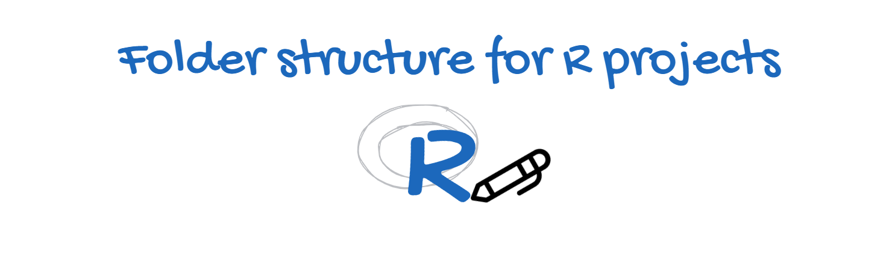

# 📝Folder Structure for R projects

## 📜 About

Some about section

## 🛠️ Installation

How to get things up

## 🎮 Usage

How to run the file

## ⚙️ Configuration

Any specifics to configure

## 🤝 Contributing

How to contribute

## 📝 License

This project is [Apache](http://www.apache.org/licenses/LICENSE-2.0) licensed.

## 🙏 Acknowledgements

Any acknowledges 

---

Made with ❤️ by Johandielangman

